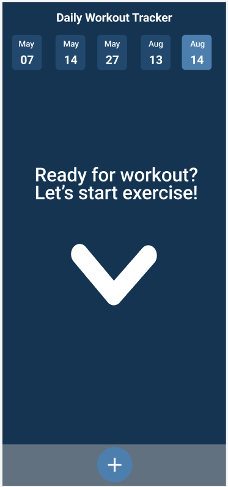
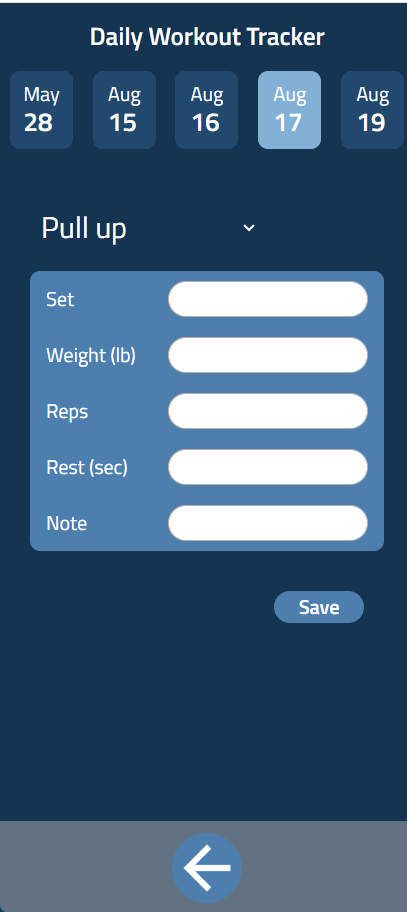
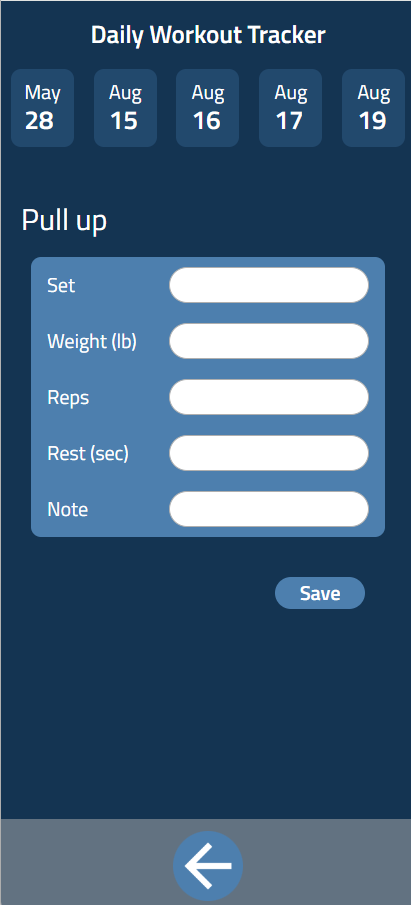

# Fitness tracker


## Overview

 A fitness tracker is an instrument designed to monitor and record the progress of one's weight training regimen


### Problem

Do you remember how heavy the weight you used was during your last workout at the gym? Do you struggle to keep track of your workouts and progress?

If so, this app is perfect for you.

### User Profile

This app is designed for individuals who prioritize fitness and aspire to lead a healthy lifestyle. It aiding users in achieving their ideal physique, assists those engaged in weight training by tracking their progress effectively.
  

### Features

### Sitemap

#### **Home page:**
When you open the app, you will see a list of dates at the top. These are the dates when you worked out and recorded your sessions. 
A tag for the current date will be automatically created and highlighted on the right. 
Clicking the '+' button at the bottom of the page will take you to the 'Add Exercise' page, where you can log the details of your workout for the current date. 
Clicking on any date at the top will take you to a page displaying the workout data you recorded for that day.
After you went to the single date data display page, the '+' button will bring you to the page to add workout for the selected date.
<p>
    
</p>

  
#### **Add Exercise Pages:**
There is a drop down manual in add exercise page, you will be able to select the exercise you want to log. (There are only few exercise now, will try to link it to workout api bring more options in the future)

<p>
    
</p>
  
#### **Add Exercise Pages:**
On the add set page, the exercise name you selected to add on set, will be automatically appear on the top
<p>
    
</p>

### Client:
1. All dependencies will be included in the package.json file. To get started, run:
```
npm install
```

2. The BASE_URL has been set to port 8080 in the utils.js file. If needed, change this.

3. Once dependecies have been installed, start up the application by running:
```
npm run dev
```


### Server:

1. Ensure to have Node.js installed.

2. Download the [server](https://github.com/Haijing1/fitness-tracker-backend-haijing).

3. All dependencies will be included in the package.json file. To get started, run:
```
npm install
```

4. Set up a new .env file and copy variables from .env.sample file.

5. To start up the server, run:
```
npm run dev
```

### Tech Stack
- React
- JavaScript
- Express
- Client libraries:
	- react
	- react-router
	- axios
	- useNavigate
	- useParams
- Server libraries:
    - knex
    - express


### APIs
Might add APIs for tranning names and images in the future


### Data
Describe your data and the relationships between them. You can show this visually using diagrams, or write it out.
```
[
    {
        "id": "3fa85f64-5717-4562-b3fc-2c963f66afa6",
        "timeStamp": "Tue May 28 2024 00:00:00 GMT+0000",
        "date": "28-5-2024",
        "workout": [
            {
                "id": "a0c8dd70-4a3a-47ab-a9b7-f0e04e5a97b8",
                "exercise": "Pull up",
                "sets": [
                    {
                        "id": "b1c1a5d0-8992-4b47-bb14-2f1b02c0f760",
                        "setNumber": "1",
                        "reps": "16",
                        "weight": "64",
                        "rest": "60",
                        "note": ""
                    }
                ]
            }
        ]
    },
    {
        "id": "88ef6886-0f9b-42c1-84a0-f4102db4d134",
        "timeStamp": "2024-08-16T04:23:58.692Z",
        "date": "15-8-2024",
        "workout": [
            {
                "id": "6181132b-644f-478e-a304-7fc543d09b87",
                "exercise": "Pull up",
                "sets": [
                    {
                        "id": "659c9b80-8e5d-4df0-981f-97cfbbfb2761",
                        "setNumber": "4",
                        "reps": "20",
                        "weight": "20",
                        "rest": "20",
                        "note": ""
                    },
                    {
                        "id": "04699730-46fd-4066-a235-e3e54a9173cd",
                        "setNumber": "2",
                        "reps": "15",
                        "weight": "45",
                        "rest": "15",
                        "note": "Hey"
                    }
                ]
            }
		]
	}
]
```
  

### Endpoints
List endpoints that your server will implement, including HTTP methods, parameters, and example responses.
**GET**
- Get all the workout data 

**GET /:date**
- Get Single date workout data

Response: 
```
[
	{
        "id": "3fa85f64-5717-4562-b3fc-2c963f66afa6",
        "timeStamp": "Tue May 28 2024 00:00:00 GMT+0000",
        "date": "28-5-2024",
        "workout": [
            {
                "id": "a0c8dd70-4a3a-47ab-a9b7-f0e04e5a97b8",
                "exercise": "Pull up",
                "sets": [
                    {
                        "id": "b1c1a5d0-8992-4b47-bb14-2f1b02c0f760",
                        "setNumber": "1",
                        "reps": "16",
                        "weight": "64",
                        "rest": "60",
                        "note": ""
                    }
                ]
            }
        ]
    }
]
```

**POST /:date/workout**
- Add workout under the selected date

**POST /addset**
- Add set under the selected workout


### Auth
Does your project include any login or user profile functionality? If so, describe how authentication/authorization will be implemented.

I will like to add Auth in the future

  

## Roadmap
Scope your project as a sprint. Break down the tasks that will need to be completed and map out timeframes for implementation. Think about what you can reasonably complete before the due date. The more detail you provide, the easier it will be to build.

  

## Nice-to-haves
Your project will be marked based on what you committed to in the above document. Under nice-to-haves, you can list any additional features you may complete if you have extra time, or after finishing.

A lot lot more......