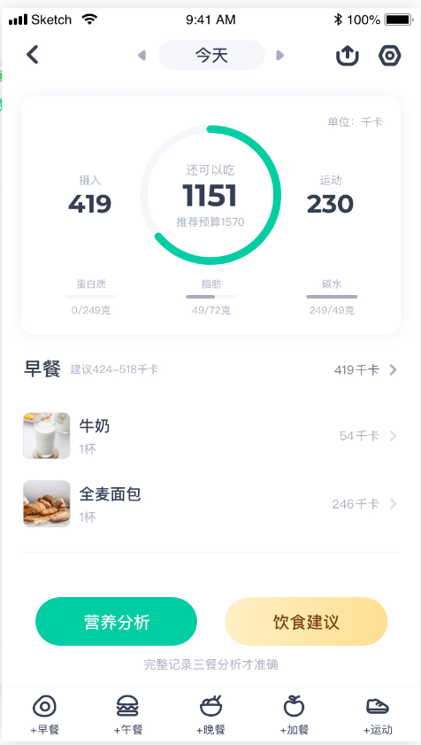

# Fitness tracker

## Overview

 A fitness tracker is an instrument designed to monitor and record the nutritional intake from each meal, as well as track the progress of one's weight training regimen

### Problem

Are you eager to know the exact calories, protein, and carbs you consume? Do you understand your body's nutritional needs to attain your ideal physique? Do you struggle to keep track of your workouts and progress in the gym? 

If so, this app is perfect for you.

### User Profile

This app is designed for individuals who prioritize fitness and aspire to lead a healthy lifestyle. It provides detailed insights into daily nutritional intake, aiding users in achieving their ideal physique. Additionally, it assists those engaged in weight training by tracking their progress effectively.
  

### Features
List the functionality that your app will include. These can be written as user stories or descriptions with related details. Do not describe _how_ these features are implemented, only _what_ needs to be implemented.
#### **Login page:**
*Create an account or log in with as an existing user.* 

you will be able to register as a new user and start tracking the food you eat and the exercise you did. 
The new user name, password and other information will be wrote into Json file/database? in the backend, so next time when you run the application and login, the application will be able to get the user information and record base on their username and password/token?

#### **Food Record Pages:**
*Food Input Page*

    

*Food Search Page - might not have time to work on this page*

  

  *Food Information Page - might not have time to work on this page*

    
    

*Food Detail Page - might not have time to work on this page*

    

  
#### **Exercise Record Pages:**
*Exercise Input Page*
On the side bar, list the weight and date the user used latest time when they did the same exercise 
Add one more input for note about the feeling while doing the exercise
choice upper body or lower body training on top left

*Single Exercise Input Page - might not need this page*
Add one more input for note about the feeling while doing the exercise

## Implementation

List technologies that will be used in your app, including any libraries to save time or provide more functionality. Be sure to research any potential limitations.
  

### Tech Stack
- React
- JavaScript
- MySQL
- Express
- Client libraries:
	- react
	- react-router
	- axios

- Server libraries:
	- knex
	- express
	- multer?
	- bcrypt?

### APIs
I might need to download an api and save it as a knex seed.
1. I need an Api for food nuration information, better including image for each food.
2. I might also need a Api for commit weight training exercise, with images for each exercise.

  

### Sitemap

  

List the pages of your app with brief descriptions. You can show this visually, or write it out.

  

### Mockups

  

Provide visuals of your app's screens. You can use tools like Figma or pictures of hand-drawn sketches.

  

### Data

  

Describe your data and the relationships between them. You can show this visually using diagrams, or write it out.

  

### Endpoints

  

List endpoints that your server will implement, including HTTP methods, parameters, and example responses.

  

### Auth

  

Does your project include any login or user profile functionality? If so, describe how authentication/authorization will be implemented.

  

## Roadmap

  

Scope your project as a sprint. Break down the tasks that will need to be completed and map out timeframes for implementation. Think about what you can reasonably complete before the due date. The more detail you provide, the easier it will be to build.

  

## Nice-to-haves

  

Your project will be marked based on what you committed to in the above document. Under nice-to-haves, you can list any additional features you may complete if you have extra time, or after finishing.